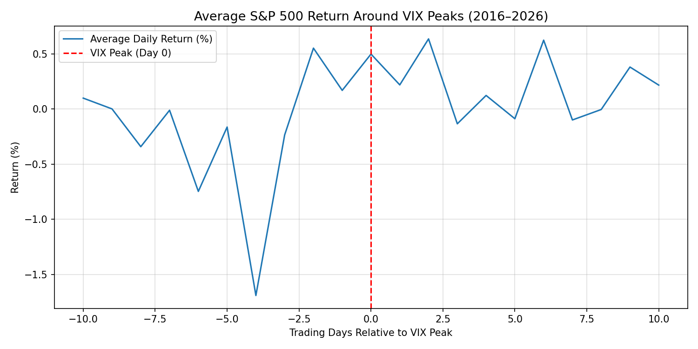
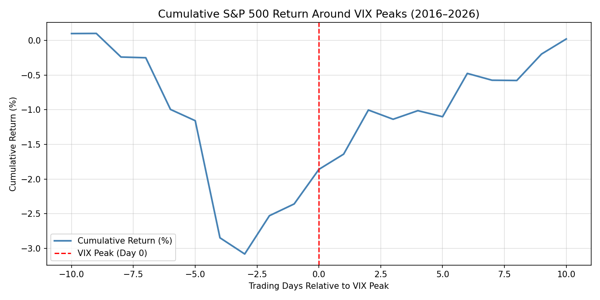
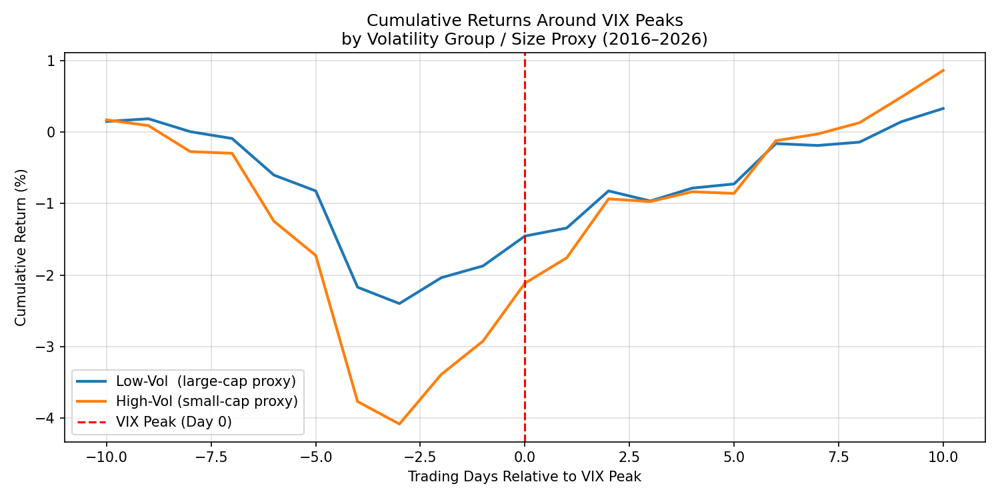
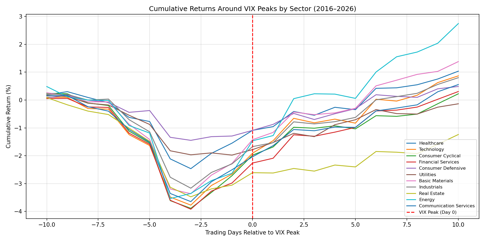

# Market Returns Around VIX Peaks (2016–Present)
### Replication & Extension of an Event-Study Framework
**FIN 559 — Group 4**

---

## Summary

This project applies an **event-study methodology** to examine how U.S. equity markets behave
around spikes in the CBOE Volatility Index (VIX). We identify local VIX peaks above a threshold
of 25, construct ±10 trading-day event windows, and compute average and cumulative returns —
both at the index level and cross-sectionally across volatility-sorted portfolios and GICS sectors.

---

## Research Question

> Do U.S. equity markets exhibit a systematic pre/post-peak return pattern around VIX spikes?
> Does this pattern differ by firm size (proxied by realized volatility) or market sector?

---

## Methodology

| Step | Description |
|------|-------------|
| Peak detection | Local maximum of VIX over a ±5-day rolling window, minimum level ≥ 25 |
| Event window | [−10, +10] trading days relative to each peak |
| Index analysis | Average Abnormal Return (AAR) and Cumulative AAR (CAR) for S&P 500 |
| Size proxy | Stocks split at median **realized volatility** — low-vol ≈ large-cap, high-vol ≈ small-cap |
| Sector analysis | Equal-weighted portfolios from current S&P 500 constituents by GICS sector |

> **Important methodological note:** The "large-cap" and "small-cap" groupings are
> **volatility-based proxies**, not formal market-capitalisation sorts. Volatility and
> market cap are positively correlated but are not the same thing. All size-related
> conclusions should be read with this caveat in mind.

---

## Data Sources

| Source | What | How |
|--------|------|-----|
| Yahoo Finance (`yfinance`) | VIX, S&P 500 index, individual stock prices | Live download each run |
| GitHub (datasets/s-and-p-500-companies) | Current S&P 500 constituent list | Live download each run |
| Yahoo Finance (`yf.Ticker.info`) | GICS sector labels | Live download; cached to `sector_cache.json` after first run |

**No local data files are bundled.** All data is fetched at runtime.

---

## Project Structure

```
fin 559/
├── vix_peaks_event_study.ipynb        ← main analysis notebook (clean, no outputs)
├── Final Vix 1 (1).ipynb              ← original notebook (preserved for reference)
├── requirements.txt                   ← Python dependencies
├── .gitignore                         ← standard Python/Jupyter ignores
├── README.md                          ← this file
├── figures/                           ← auto-created by notebook; committed plots
│   ├── fig1_aar_spx.png               ← Average daily return around VIX peaks
│   ├── fig2_car_spx.png               ← Cumulative return around VIX peaks
│   ├── fig3_car_size_proxy.png        ← CAR by volatility group (size proxy)
│   └── fig4_car_sectors.png           ← CAR by GICS sector
├── sector_cache.json                  ← auto-generated on first run (gitignored)
├── FIN 559 Group 4 Presentation (1).pdf
└── Final Vix.pdf
```

---

## Setup & Installation

### Prerequisites
- Python ≥ 3.9
- Internet access (all data is downloaded at runtime)
- **yfinance ≥ 0.2.50** — older versions (including 0.2.28) are broken against the
  current Yahoo Finance API and will silently return empty data frames

### Install dependencies

```bash
# Recommended: use a virtual environment
python -m venv .venv
source .venv/bin/activate      # macOS / Linux
.venv\Scripts\activate         # Windows

pip install -r requirements.txt
```

---

## How to Run

```bash
jupyter notebook vix_peaks_event_study.ipynb
```

Then: **Kernel → Restart & Run All**

### What the notebook does, step by step

| Step | Duration | Description |
|------|----------|-------------|
| Data download (VIX + SPX) | ~5 s | Downloads ~2,500 daily rows |
| VIX peak detection | instant | Finds ~40 peaks ≥ 25 |
| Index event study | instant | Builds (40 × 21) event matrix, plots AAR/CAR |
| S&P 500 prices | ~1–2 min | Downloads ~503 tickers |
| Sector info fetch | **~5–15 min** (first run only) | ~500 individual `yf.Ticker` calls; cached afterwards |
| Plots + summary tables | instant | Saves 4 figures to `figures/` |

> **To pin results to a fixed date**, change `END_DATE = None` to
> `END_DATE = "2025-12-31"` in the *Configuration* cell before running.

> **On subsequent runs**, the sector-info step uses `sector_cache.json` and
> takes only a few milliseconds.

---

## Key Findings

*(Based on data from 2016-01-01 to present; 40 VIX peaks detected.)*

1. **Mean-reversion pattern at the index level:**
   The S&P 500 returns an average of **−0.24%/day** in the 10 days *before* a VIX peak
   and **+0.19%/day** in the 10 days *after*, consistent with panic-driven overselling
   followed by recovery.

2. **Volatility-group asymmetry (size proxy):**
   - Low-volatility portfolio (large-cap proxy): pre −0.19%/day → post +0.18%/day
   - High-volatility portfolio (small-cap proxy): pre −0.29%/day → post +0.30%/day

   High-volatility stocks sell off harder and rebound more strongly — broadly consistent
   with the *overreaction hypothesis*. Note the caveat above regarding the proxy.

3. **Sector heterogeneity:**
   Energy and Financial Services show the largest post-peak reversals (Δ ≈ +0.55–0.68 pp/day);
   defensive sectors (Consumer Defensive, Utilities) show the smallest responses.
   
   ## Results

### S&P 500 Reaction Around VIX Peaks




### Volatility-Sorted Portfolios


### Sector Responses


---

## Limitations

| # | Limitation |
|---|------------|
| 1 | **No benchmark subtraction** — returns are raw averages, not risk-adjusted abnormal returns. |
| 2 | **Survivorship bias** — uses the *current* S&P 500 constituent list; firms delisted since 2016 are excluded. |
| 3 | **Volatility ≠ market cap** — the size proxy is an approximation; formal size-sorted portfolios require capitalisation data (e.g. CRSP). |
| 4 | **Overlapping event windows** — closely-spaced peaks share trading days, which can inflate apparent significance. |
| 5 | **No significance testing** — the study reports average returns only; standard errors and t-statistics are not computed. |
| 6 | **Live data dependency** — results vary slightly across runs as Yahoo Finance data updates. |
| 7 | **Sector labels are current, not historical** — GICS classifications reflect today's assignments. |

---

## Reproducibility Notes

- `END_DATE = None` (default) fetches data through today; set it to a fixed string to
  reproduce a specific study period.
- The S&P 500 constituent list is fetched live and reflects *current* membership.
- `yfinance` API responses can occasionally fail or return incomplete data.
- `sector_cache.json` is gitignored; delete it to force a fresh sector-info fetch.
- The notebook uses `matplotlib.use('Agg')` for compatibility with headless/CI environments.

---

## Future Improvements

- Replace the volatility proxy with actual market-cap data (CRSP / Compustat).
- Add a CAPM or Fama-French benchmark to compute genuine abnormal returns.
- Implement CAR significance tests (Brown–Warner event-study t-statistics).
- Explore sub-periods: pre/post COVID, Fed rate-hike cycles, etc.
- Cache price data locally to reduce runtime and Yahoo Finance dependency.
